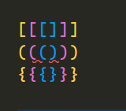

  

---

# `Bienvenidos a ReactJs`

---

## `Bloques temáticos:`

- [**Extensiones y recomendaciones**](#item1)
- [**homework**](#item2)

---

---

Ha llegado el gran momento esperado por todos. Comenzar a trabajar con ReactJs. El objetivo de esta documentación, además de ver cuál será nuestro desafío, también será conocer algunos consejos y extensiones de VSCode que nos darán ciertas ventajas en React. No vamos a abarcar muchas, como tampoco conoceremos los snippets, ya que preferimos que escriban todo el código manualmente. Nuestra intención es presentarles las que consideramos más importante para el trayecto del curso. Si bien estas extensiones son para VSCode, cada una de ellas tienen sus alternativas para otros editores de textos.

## `Extensiones y recomendaciones`

`Bracket Pair Colorizer 2`

Esta era una extensión que hoy ya es parte de VSCode, es decir, que ya está integrada. Esto agrega los colores del arcoíris a los corchetes, paréntesis y llaves, los cuales a través del anidamiento tendrán distintos colores. Te aseguro que te salvará más de una vez.

Para activarla presione "ctrl+," o archivos -> preferencias -> Configuración

En el buscador poner "bracket pair"

Una vez allí, puedes probar esta configuración que les dejo a continuación, tanto en usuario como en área de trabajo:

resultado:

`Material icon theme`

Esta extensión lo que hace es agregar un icono a nuestros archivos para que sean más fáciles de reconocer. Parece una pavada, pero a medida que nuestra aplicación crece irá siendo una extensión muy útil.

Para habilitar simplemente debes buscar en el apartado de extensiones "Material icon theme".

resultado:

`ESLint`

Esta es la extensión más importante de todas. La considero realmente sagrada. Nos va a ayudar en cualquier proyecto, inclusive con otras librerías o frameworks. Tanto create-react-app como ng new de Angular, traen configuraciones especiales de ESLint, las cuales nos van a marcar problemas de sintaxis y nos darán algo de información de que estamos escribiendo o haciendo mal, pero para ver esto, necesitaríamos de esta grandiosa extensión.

Para habilitar simplemente debes buscar en el apartado de extensiones "ESLint".

resultado:

`Auto close tag`

Aquí en React utilizaremos mucho los tags, por ende, esta extensión es súper útil. Tal y como lo menciona el propio nombre, lo que hace es cerrar de manera automática alguna etiqueta. Por ejemplo si escribimos `
`, a la hora de ingresar el mayor, que es el símbolo posterior a la "v", ya completa el resto `
`.

Para habilitar simplemente debes buscar en el apartado de extensiones "Auto close tag".

[`subir`](#top)

---

---

### `Homework`

Con lo visto en clase será suficiente para realizar el siguiente ejercicio.

`Ejercicio React`

- Vamos a crear una ficha de una selección de básquet que consiste en un `h1` con el nombre de la selección y luego etiquetas `
` o `` con información de posición, partidos jugados, y tipo de liga. Los datos son a elección y ficticios.  
  Para lograrlo vamos a crear un componente ‘Equipo’ que incorpore esos elementos e ingresamos los datos de ejemplo.  
  Ese componente lo inyectamos en App
